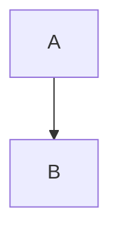
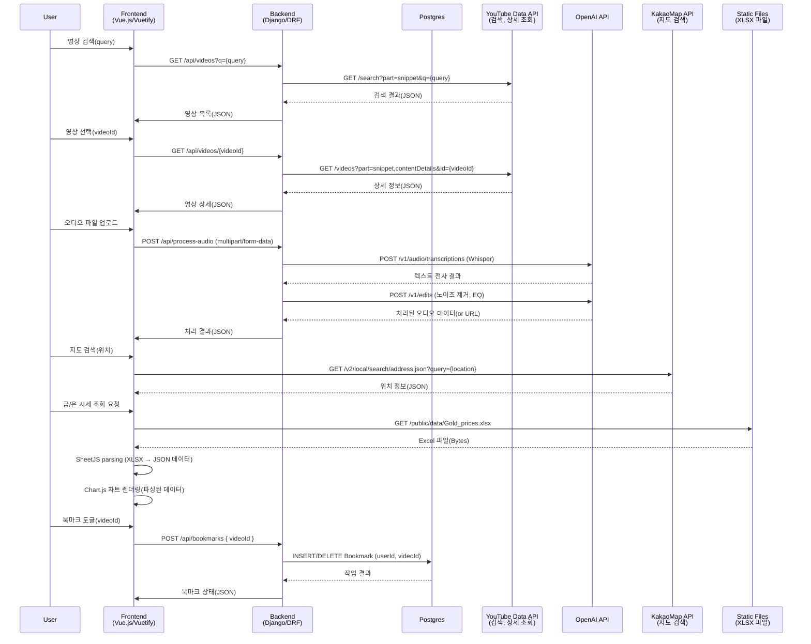

# FinBar

<p align="center">

</p>

## 배포 주소

```

```


## 팀원 소개
| 이름       | 역할 및 담당 업무                       | 사용 기술 스택 및 도구                                |
| ---------- | --------------------------------------- | ----------------------------------------------------- |
| 권인       | 프론트엔드 개발<br> (UI 구현 및 기능 연동)  | Vue.js, Vuetify, Axios, Toast UI Editor, chart.js, SheetJS, KAKAOMAP API               |
| 김혜정     | 백엔드 개발<br> (API 설계 및 DB 모델링)     | Django Rest Framework (DRF), PostgreSQL, <br> Google Cloud SQL, Google Cloud Run, OpenAI API, Youtube Data API |

## 프로젝트 소개 
> **나만의 금융 레시피로 블렌딩한 맞춤 금융 상품 추천 서비스, FinBar**
* 사용자의 투자 성향과 자산 정보를 기반으로 AI 기반 맞춤 금융 추천 상품 정보를 제공합니다.
* 예, 적금 상품을 조회하고 각 금리 정보를 비교할 수 있습니다.
* 금, 은 등의 현물 시세 변동 추이를 그래프로 확인할 수 있습니다.
* 주변 은행의 위치정보를 지도로 검색할 수 있습니다.
* 주식 관련 영상을 검색할 수 있습니다.
* 게시판에서 사용자 간 정보를 공유하고 소통할 수 있습니다.


## 시작 가이드

### Requirements

### Installation
```
$ git clone
$ cd final-pjt
```

#### Backend
```
$ cd final-pjt-back
$
$
```

#### Frontend
```
$ cd final-pjt-front
$
$ 
```

## 주요 기능
* 랜딩페이지

* 사용자 인증
  * 회원 가입, 로그인
  * 비밀번호 변경, 회원 정보 수정 기능

* 예적금 상품 조회
  * 다양한 은행들의 예적금 상품 최신 금리 정보 제공
  * 기간별, 은행별 정보 필터 기능으로 사용자에게 필요한 정보 제공

* 커뮤니티
  * 게시글을 작성할 수 있는 게시판
  * 게시글에 대한 댓글 작성 기능
  * 각 게시글, 댓글에 대한 생성/수정/삭제 기능

* 맞춤 금융 상품 추천
  * AI 기반를 활용한 사용자 맞춤형 분석을 통해 개인의 투자 성향을 고려해 적절한 상품을 추천합니다. 
  * OpenAI API를 기반으로 사용자의 투자 성향, 목표 자산 등을 고려하여 맞춤형 금융 상품을 추천합니다.

* 주변 은행 찾기
  * 카카오맵 API를 이용해 사용자가 선택한 지역 인근 은행의 위치와 정보를 쉽게 검색할 수 있습니다.

* 주식 관련 영상 검색
  * 유튜브 API를 통해 투자자에게 도움이 될 만한 주식 관련 영상을 빠르게 검색하여 제공합니다.

* 금/은 시세 차트
  * Chart.js와 SheetJS를 사용하여 금과 은의 시세 변동을 직관적으로 시각화하여 제공합니다.

## 기술 스택 (Stacks)

#### Frontend  
 
 
 

#### Backend  
 
 
 
 

#### Deployment  
 
 
 
 

#### Tools  
 
 
 

## 아키텍처


(아키텍처 mermaid 만들어서 추가하기)


(데이터 요청흐름도 시퀀스 다이어그램으로 만들어도 될 듯?)


(프로젝트 구조 tree 표현하기)

## 생성형 AI 활용

* 벡터 이미지 생성
  웹 페이지의 디자인과 시각적 요소에 필요한 벡터 이미지를 생성형 AI(OpenAI API)를 활용하여 제작하였습니다.
    ```
    
    ```

* 프로젝트 계획 수립
  PM 겸 개발자의 페르소나로 설정한 프롬프팅을 통해 프로젝트 계획 및 전략 수립 과정에서 효과적으로 활용되었습니다.
    ```
    넌 15년 경력의 디자이너 겸 프론트엔드 개발자임을 숙지해줘,
    먼저 이 프로젝트 속 대화들을 참고해서 지금까지의 프로젝트 정보를 다시 한 번 정리해줄래?
    ```


## 회의록

|일자|내용|
| -- | -- |
|250527|역할 분담 <br> * 일일 작업 계획 <br> * 각 작업 간 이슈 공유 프론트(혜정) <br> * 추천 페이지 생성 프론트(인) <br> * 추천 페이지 생성 <br> * 디자인  백엔드 <br> * 북마크(상품 가입)수정 <br> * 가입 상품 차트 시각화 <br> * 예적금 페이지 수정 이슈 및 결정 사항 <br> * 필수 기능 구현 집중 <br> * 오류 수정 및 다듬기 |
|250526|상품 추천 알고리즘 <br> * 일일 작업 계획 <br> * 각 작업 간 이슈 공유 프론트 <br> * 예적금 상품 페이지 구현 <br> * 유튜브 검색 화면 구현 백엔드 <br> * 상품 추천 알고리즘 관련 사항 <br> 1. 투자 성향 설문 2. 한국 자산 정보 api 3. 주식 관련 데이터 수집이슈 및 결정 사항 <br> * 인증/권한 미설정 관련 문제 확인 <br> * 연령별 자산 정보 제공 및 사용자 목표 입력 후 현재 사용자 투자 성향과 목표와 적합한 투자 성향 제시|
|250523|공통 <br> * 일일 작업 계획 <br> * 각 작업 간 이슈 공유 프론트 <br> * 컴포넌트 구조 설정 ✅ <br> * 회원정보 수정 페이지 구현 ✅ <br> * 은행 지도 페이지 구현 ❌ <br> * 게시판 CRUD 페이지 구현 백엔드 <br> * 회원정보 Serializer 코드 오류 해결 <br> * 게시판 CRUD 로직 구현 이슈 및 결정 사항 <br> * user serializer 이슈 조치 <br> * API_KEY 요청 BE에서 처리 <br> * 배포 시 HTTPS 적용 확인 (firebase => https) <br> * 게시글 생성 후 게시글 상세로 이동 <br> * 게시글 생성 시 ID(username) 사용|
|250522|(김혜정) 코드 및 작동 확인 공통 <br> * 역할 분담 <br> * notion을 활용한 개발 계획(backlog) 설정 프론트 <br> * Figma 와이어 프레임 설정 ✅ <br> * 컴포넌트 구조 설정 <br> * 사용자 로그인, 회원가입 페이지 구현 ✅ 백 <br> * 사용자 로그인 구현 ✅ <br> * 사용자 회원가입 구현 ✅ 이슈 및 결정 사항 <br> * 회원가입 시 입력받는 값 `username`, `password`, `email`, `nickname` (커뮤니티 기능을 위해, USER 모델에 `nickname` 컬럼 추가) <br> * local storage 와 pinia 연동, 상태 저장 및 삭제 기능 <br> * Pinia Plugin Persistedstate 문서 확인 <br> * token 인증 방식 사용 <br> * 추후 대댓글 기능(테이블) 추가 예정 <br> * 댓글 수정 기능 (테이블) 추가 완료 * 회원가입 시 나이 입력 받기 <br> * (FE, BE) 회원 정보 수정 기능 구현 <br> * (FE) firebase 배포 시 https 여부 확인  <br> * (BE) settings.SECRET_KEY `.env`에 추가 ✅ <br> * (BE) API 문서화 ✅|

(notion 링크 추가)

## 회고
* (velog 링크)
* (Qiita 링크) 
